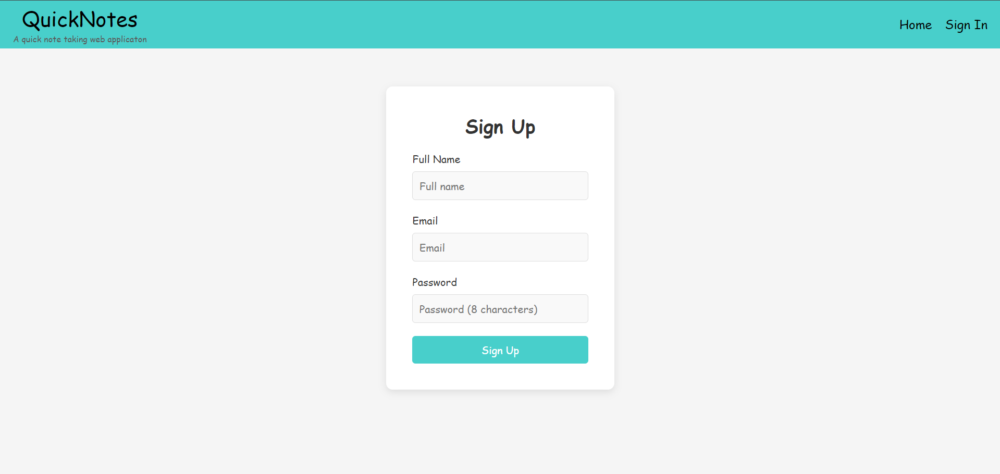
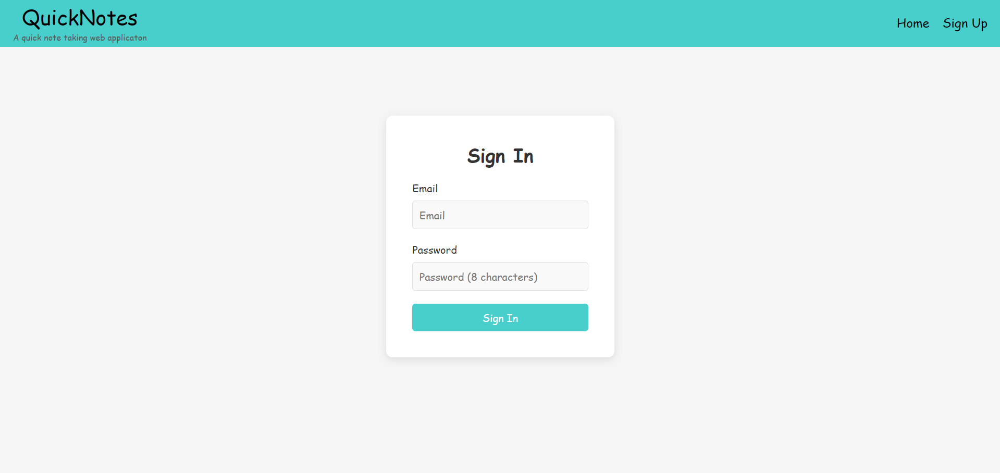
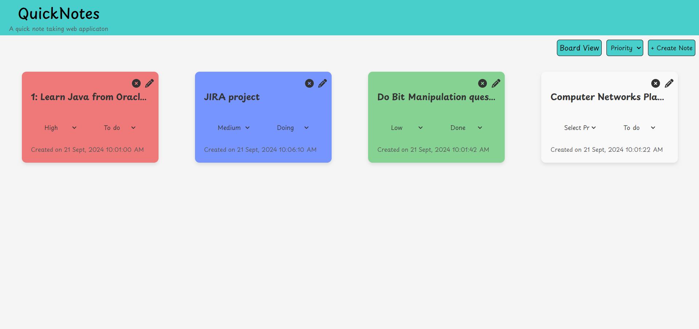
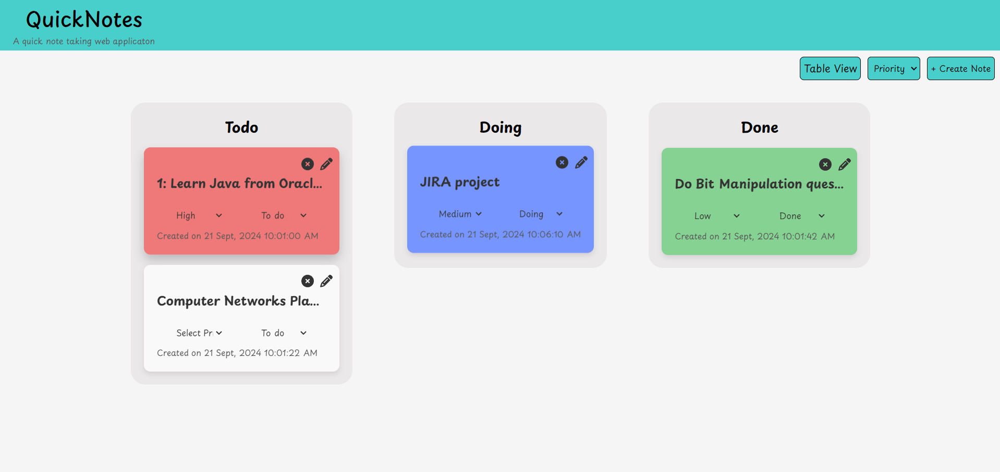
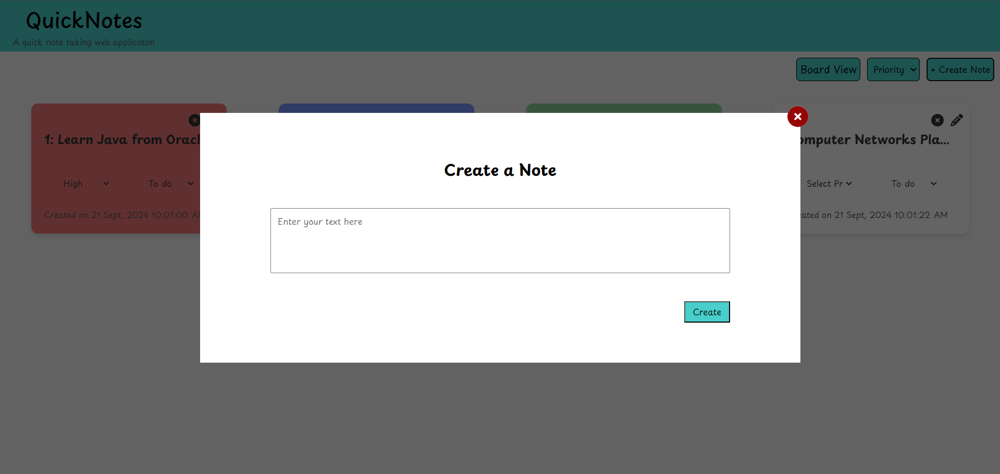
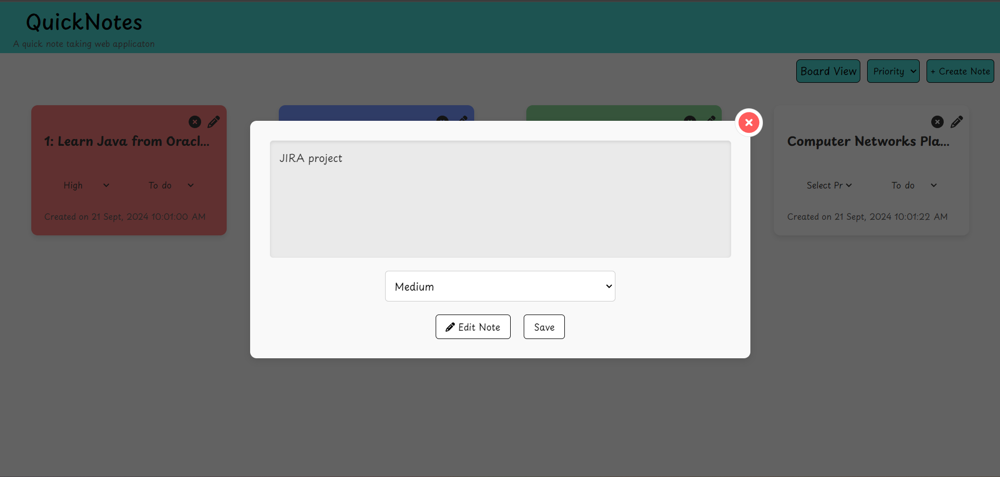

# QuickNotes

QuickNotes is a web application that allows users to create, view, edit, delete, and organize notes into different sections such as **To do**, **Doing**, and **Done**. Notes are stored in localStorage to persist across sessions. The app includes a drag-and-drop feature for moving notes between sections and color-coding based on priority.

## Features

- **Sign Up**: Users can create an account by providing a unique username and password. The app will store user credentials in localStorage, allowing them to sign in from any session.
- **Sign In**: Registered users can log in with their username and password. After signing in, the app will load the notes specific to that user.
- **Create Notes**: Users can create new notes with content, priority, and timestamp.
- **Drag and Drop**: Notes can be dragged between **To do**, **Doing**, and **Done** sections.
- **Edit Notes**: Users can edit existing notes and save changes.
- **Delete Notes**: Notes can be deleted permanently.
- **Priority and Status**: Notes can be assigned a priority (High, Medium, Low) and a status (To do, Doing, Done).
- **Sort Notes**: Users can sort notes based on priority or default creation order.
- **Persistent Data**: Notes are stored in localStorage and persist even after page reloads.


## Screenshots

1. **Signing Up**

   

1. **Signing In**

   

3. **Main Interface**

   

4. **Board Interface**

   

5. **Note Creation**

   

6. **Note Editing**

   


## File Structure

```bash
QuickNotes/
├── assets/
│   ├── CSS/
│   │   └── styles.css
│   └── Javascript/
│       ├── board.js
│       ├── constants.js
│       ├── signin.js
│       ├── signup.js
│       └── index.js
├── screenshots/
│   ├── board_interface.png
│   ├── main_interface.png
│   ├── note_creation.png
│   ├── note_editing.png
│   ├── signin.png
│   ├── signup.png
│   └── userImage.webp
├── board.html
├── index.html
├── signin.html
├── signup.html
└── Readme.md
```


### Installation

1. Clone the repository to your local machine :

   ```bash
   git clone https://github.com/sujal1256/QuickNotes
   ```

2. Navigate to the project directory :

   ```bash
   cd QuickNotes
   ```

3. Open the `index.html` file in your browser and start your live server:

   ```bash
   open index.html
   ```
